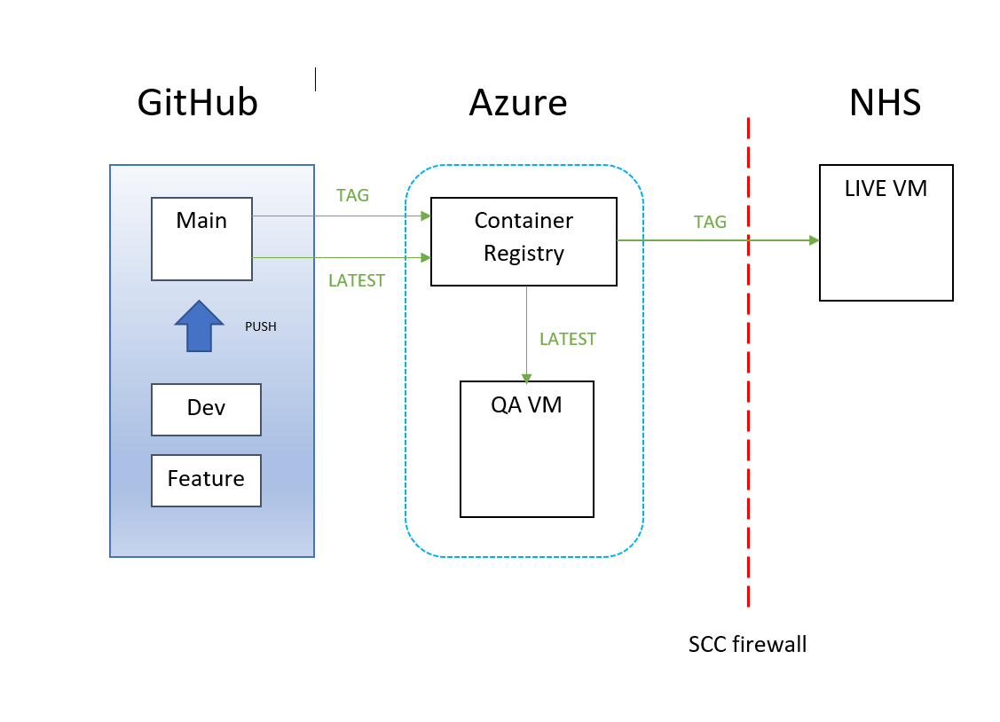

# vue-eprase

> The Vue version of the eprase client.

## About

Eprase is a tool to test electronic prescribing systems used by NHS Trusts in England. It has a Vue based client (front-end) and Java Spring Boot server based back-end that interacts with a Postgres database. This repo contains the client code base.

### Project Team

* Becky Osselton, Newcastle University  ([rebecca.osselton@newcastle.ac.uk](mailto:rebecca.osselton@newcastle.ac.uk))
* Mark Turner, Newcastle University  ([mark.turner@newcastle.ac.uk](mailto:mark.turner@newcastle.ac.uk))
* Jude Heed, Newcastle University ([Jude.Heed@newcastle.ac.uk](mailto:jude.heed@newcastle.ac.uk))
* Stephanie Klein, The Newcastle Hospitals NHS Foundation Trust  ([stephanie.klein@nhs.net](mailto:stephanie.klein@nhs.net))
* Neil Watson, The Newcastle Hospitals NHS Foundation Trust ([neil.watson14@nhs.net](mailto:neil.watson14@nhs.net))


### RSE Contact
Becky Osselton/Mark Turner, RSE Team, Newcastle University


### Built With

* [Vue.js](https://vuejs.org/)
* [Java - Spring Boot Framework](https://spring.io/projects/spring-boot)
* [Postgres](https://www.postgresql.org/)

### Prerequisites

Node.js, Git

## Local Development Build Setup

Pull down the copy of the repo, then cd into the directory and use npm to install the required dependencies

``` bash
# install dependencies
npm install

# serve with hot reload at localhost:8080
npm run dev
```

### Control of version number shown

Adjust the value of the `version` variable in the settings.js file to match any major version updates. This is shown in small print on the welcome page of the application.


### Open/close the application to users, while keeping it open to admin

Adjust the value of the `appOpen` variable in the settings.js file. e.g. `appOpen : false`.

 This variable controls whether the 'start' button is shown on the application welcome page. Users will still be able to navigate directly to the login page (as this needs to be kept open for admin access). However, the server-side environment variable APP_OPEN should be set to 'false' in this case, this will ensure that only users with admin roles will be able to log into the application.

It should be possible to update the appOpen variable without affecting the overall application (and database) by manually bringing down the client only and pulling an updated image with the docker commands:

* `$ docker-compose stop <service_name>`
* `$ docker-compose pull <service_name>`
* `$ docker-compose up -d <service_name>`

The service_name in the docker-compose file is currently set to 'client'.

## Deployment Overview



## Staging Deployment

The QA version of eprase is hosted at: https://eprase.ncldata.dev/. This staging version of the application is designed for testing and will be automatically updated and deployed by a push to the `main` branch. This could be done manually, or by merging a Pull Request from `dev` branch to `main`.

Access to the staging VM:

`ssh -i <path-to-your-private-key> adminuser@51.140.36.254`

Containers can be explored using the following command,  `sudo docker ls -a` will list all the container ids.

`sudo docker exec -it <container-id> /bin/bash`

On the staging server, the eprase-client image is tagged as `latest`.  (The docker service name is 'client'). If the application is refusing to update, the current 'latest' image may need to be removed manully before doing a `docker-compose pull client` command. Find the existing eprase-client image id with:

`$ sudo docker image ls`

Then remove the image with `$ sudo docker rmi <image_id>`. Pull a new image with `$ sudo docker-compose pull client:latest`. Bring the client service back up with the docker-compose command 'up -d'.

* `$ sudo docker-compose stop <service_name>`
* `$ sudo docker-compose pull <service_name>:latest`
* `$ sudo docker-compose up -d <service_name>`


### Cache

The staging version runs under the `ncldata.dev` domain, meaning cache may need to be purged after a new deployment.

## Production Deployment

Production deployment is a manual process due to protected nature of the hosting server - https://eprase.nhs.uk. Domain access is only possible through an NHS network.

This guide assumes you have access to the production server via Pulse Secure using a token provided by SCC. Contact Becky Osselton or Mark Turner if you are not in this position. Once you have a secure connection to the NHS network, connect to the VM using:

```bash
ssh <username>@192.168.241.18
```

This will prompt for your password, again provided by SCC. Immediately switch to sudo mode using `sudo -i`, which will prompt for your password again. Then change directory to `/eprase`.

To deploy a new version of the app, alter the version numbers in the `.env` file to match the latest tagged version of the client and server in the Azure eprase repository. You can also alter the status of the APP_OPEN and ENV_BUILD environment variables.

* APP_OPEN is used to limit access to the application to admin users only, when the site is offically closed to other NHS users.
* ENV_BUILD is used to prevent loss of data when the application is offcially open.

If ENV_BUILD is set to `test`, then the data for the app can be cleared using `docker-compose down -v`. Then `docker-compose up -d` will bring up a clean database, but with all the pre-required data created. This is the application being used in a testing mode.

If the application is in production mode (as in open to use by NHS users) and one of the containers has gone down, the site needs to be restored without data loss. At the beginning of an 'open' period, the ENV_BUILD variable value should be set to 'prod'. This will allow containers to be brought down and back up without the server code trying to rebuild pre-required data (which causes a build error).

 Run `source .env` to apply any changes. You can check this has worked with `echo <ENV_VAR>` and it will print the value you just set.

 ### Docker commands

 Bring down any running services including the data volumes:

```bash
docker-compose down -v
```

Bring down running services without removing the data volumes:

```bash
docker-compose down
```

Start all the services in detached mode using:

```bash
docker-compose up -d
```

New images should be pulled as part of the docker 'up' process.


Use 'docker-compose ps' to confirm that all services are running (the server, database and pgadmin). Pgadmin does not run in production.

```bash
docker-compose ps
```

#### Azure registry

Service images are hosted in a private Azure registry, login details

```bash
docker login epraseregistry.azurecr.io -u epraseregistry -p <password>
```

#### View Docker logs

If any services are down, start debugging by viewing the logs for that service.

```bash
docker-compose logs <service-name>
```
